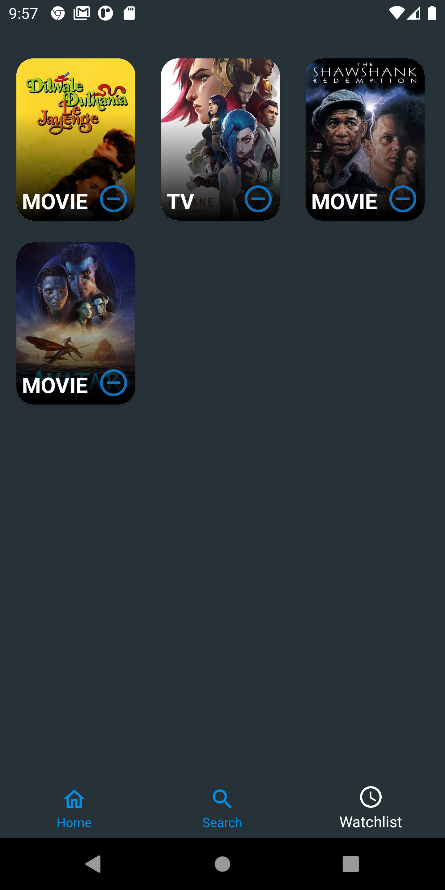
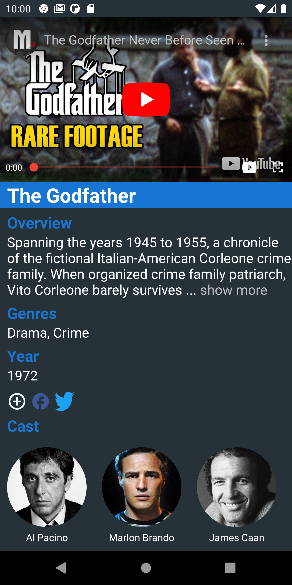

# USC Films
A simple project powered by [The Movie DB](https://www.themoviedb.org) based on Kotlin MVVM architecture.<br>
<br/>



<br/>
<br/>


<br/>
## How to build on your environment
- Create a new file in the root directory of the project called api_keys.properties. 
- Open the api_keys.properties file and add the following line:
```
API_KEY=YOUR_API_KEY
```
- Replace YOUR_API_KEY with your [The Movie DB](https://www.themoviedb.org)'s API key

## Tech stack & Open-source libraries
- MVVM Architecture with
    - UI Layer (Activity/Fragment + ViewModel)
    - Domain Layer (Use Cases)
    - Data Layer (Repositories)
- [Coroutines and Flows](https://github.com/Kotlin/kotlinx.coroutines)
- [Retrofit](https://square.github.io/retrofit/) for network requests
- [Moshi](https://github.com/square/moshi) for parsing JSON
- [Coil](https://github.com/coil-kt/coil) for image loading
- [BRVAH](https://github.com/CymChad/BaseRecyclerViewAdapterHelper) for creating RecyclerView with multiple view types